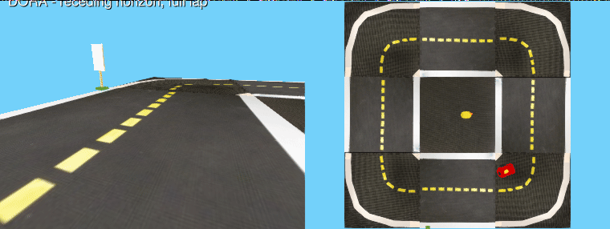

# Duckietown.jl

[](https://github.com/ai-vnv/Duckietown.jl/actions/workflows/CI.yml)
[](https://codecov.io/gh/ai-vnv/Duckietown.jl)
[](https://ai-vnv.github.io/Duckietown.jl/dev/)
[](https://github.com/ai-vnv/Duckietown.jl/blob/main/.vnvspec/spec.yaml)

A Duckietown lane-following-with-obstacles MDP, written in Julia as a
[POMDPs.jl](https://github.com/JuliaPOMDP/POMDPs.jl) problem.

It is a native reimplementation of the Python environment in
[DuckieMDP](https://github.com/PannnTastic/DuckieMDP), validated
against it decision by decision — including exact NumPy RNG streams, so a
seeded episode reproduces bit for bit.



*[DORASolvers.jl](https://github.com/ai-vnv/DORASolvers.jl) under receding
horizon completing a `:stop_and_duck_safe` lap — yielding to the crossing
duck on the way — drawn by
[`render_native`](#native-lookalike-renderer): solver, physics and renderer
all in Julia. The full formulation is the
[`notebooks/DORA_on_Duckietown.jl`](notebooks/DORA_on_Duckietown.jl) case
study. 2× speed; lookalike render, not parity evidence. Duckietown
environment by the [Duckietown Project](https://www.duckietown.org).*

```julia
using DuckietownDecisionModels, POMDPs, Random

mdp = DuckietownMDP(scenario_config(:stop_and_duck); action_space = :discrete)
s   = rand(MersenneTwister(1001), initialstate(mdp))
sp, r = @gen(:sp, :r)(mdp, s, FAST_STRAIGHT, MersenneTwister(7))
```

**No Python is involved.** `using DuckietownDecisionModels` loads no Python, no
plotting library and no solver; the map is embedded in the package.

---

## Install

Not in the General registry yet, so install from the repository:

```julia
using Pkg
Pkg.activate("duckie")            # a project of its own — see the note below
Pkg.add(url = "https://github.com/ai-vnv/Duckietown.jl")
Pkg.add("POMDPs")
```

> **Use a separate project.** The `[compat]` bounds here are deliberately
> narrow (`PythonCall = "=0.9.25"`, `Makie = "0.24"`) because those are the
> versions the parity results were produced with. In a shared environment the
> resolver will try to move your other packages to satisfy them.

Julia 1.10 or newer. Three optional extras, each enabling one extension:

| Add | Gives you |
|---|---|
| `CairoMakie` | figures and animations — renders headless, so notebooks and CI work |
| `MCTS` | run MCTS / DPW planners against the model |
| `PythonCall` | the in-process bridge to the Python reference, for parity work |

---

## The model

| | |
|---|---|
| **State** | `DuckieWorldState` — the full latent world: delayed DB18 motor model, duckie objects, stop memory, map. Branchable, so a generative planner can copy it safely. |
| **Actions** | 7 macro actions (`FAST_LEFT` … `BRAKE`), or a continuous `DuckieAction(v, ω)` box |
| **Reward** | lane progress, lateral and heading error, stop-sign compliance, pedestrian yielding, stagnation, steering smoothness |
| **Termination** | off-road, collision, duck collision, timeout |
| **Discount** | 0.99 |

Two projections of the latent state are what policies actually consume:

- `RawState` — 7 components, discretized for tabular methods
- `ContinuousState` — 15 components, the encoding SAC/TD3 were trained on

```julia
raw, _ = get_raw_state(s, mdp.transition.state_cfg)
raw.d, raw.phi        # lateral offset (m), heading error (rad)
discretize(raw)       # the tabular index
```

Both are **privileged**: they are read out of the latent world, not estimated
from sensors. Only 6 of the 15 continuous components are sensor-estimable and
2 are agent memory with no physical counterpart at all, so this is a
decision-making benchmark and not a perception one. There is deliberately no
observation or belief layer.

---

## Scenarios

`scenario_config` builds a complete world with no external file:

```julia
scenario_config(:stop_and_duck)                      # a stop sign, and a duck that crosses
scenario_config(:lane_following)                     # the Python source defaults
scenario_config(:stop_and_duck; algorithm = :td3)    # for the continuous action space
```

`default_config(:q_learning)` returns the Python source defaults directly. Be
aware of what that world contains: **no stop sign at all**, and a duck that
crosses on 2 % of episodes. It exists for provenance checks, not for driving.

---

## A worked example

[`examples/quickstart.jl`](examples/quickstart.jl) runs end to end with nothing
installed but the package itself. It builds a world, rolls out a hand-written
lane follower against an always-straight baseline, inspects the privileged
projections, and pulls the scene geometry out with no plotting backend
present. Same content as a notebook:
[`examples/quickstart.ipynb`](examples/quickstart.ipynb).

```bash
julia --project=. examples/quickstart.jl
```

The notebook is generated from the script by `tools/make_notebook.jl`, and CI
fails if the two drift apart.

---

## Drawing things

All scene geometry is computed in the core and is inspectable with no plotting
package installed; a backend only draws it.

```julia
scene = world_scene(mdp, s)     # tiles, lane centrelines, footprint, stop lines
scene.stop_lines                # available with no Makie installed

using CairoMakie                # now the renderers exist
save("world.png", render_world(mdp, s))
```

`render_world`, `render_projection`, `render_policy`, `render_search`,
`render_rollout`, `render_diagnostics`, `render_animation` and
`render_composite` all appear once Makie is loaded. `render_observation` and
`render_belief` are deliberately **not** implemented — those signatures are
reserved for a partially observable formulation that does not exist yet.

### Native lookalike renderer

With a rasterising backend and the reference asset tree on disk, the world
can also be drawn the way the reference simulator draws it — same tile
textures, same OBJ meshes, same camera constants (fov 75°, height 0.108 m,
pitch 19.15°) — with **no Python involved**:

```julia
using GLMakie                   # CairoMakie cannot texture-map per pixel
save("ego.png", render_native(w; view = :ego))   # the robot's forward camera
save("bev.png", render_native(w; view = :bev))   # top-down, ego mesh included
```

Point `ENV["DUCKIETOWN_ASSETS"]` at a gym-duckietown
`duckietown_world/data/gd1` directory (the assets are the reference's own
files and are not shipped here). A same-state comparison against the real
renderer lives at `notebooks/native_vs_reference.png`. Honesty note, quoted
from `NATIVE_RENDER_NOTE`: this is a *lookalike* for casual use — it is never
parity evidence; the recorded case-study laps use the real renderer.

---

## Running a planner

MCTS.jl drives both action spaces through the standard `solve` / `action`
sequence, with no adapter:

```julia
using MCTS
planner = solve(MCTSSolver(n_iterations = 100, depth = 20), mdp)
a = action(planner, s)
```

Wrap the model in `InstrumentedMDP` to count generative calls, which is the
unit planner budgets are quoted in here. Iteration counts are not comparable
across solvers; measured `gen` calls are.

```julia
im = InstrumentedMDP(mdp)
reset_model_calls!(im)
action(solve(MCTSSolver(n_iterations = 100), im), s)
model_calls(im)
```

### DORA: a full worked case study

[`notebooks/DORA_on_Duckietown.jl`](notebooks/DORA_on_Duckietown.jl) is a
Pluto notebook showing an online SSP solver
([DORASolvers.jl](https://github.com/ai-vnv/DORASolvers.jl)) driving this
model end to end: the SSP formulation (measured-deterministic kernel, key
aggregation, ring-progress goal, reward-derived costs), receding-horizon
execution, and tile-by-tile replays of two recorded laps — a `small_loop`
lap that yields to the crossing duck and performs a full stop at the sign,
and a 26-tile `zigzag_dists` lap. The notebook also runs the solver live on
a reduced task. The experiment and diagnostic scripts next to it reproduce
every number.

```julia
using Pluto; Pluto.run()   # then open notebooks/DORA_on_Duckietown.jl
```

[`notebooks/Playground.jl`](notebooks/Playground.jl) is the companion
starter: pick a scenario and a solver (random / MCTS / DORA), tick run, and
watch the schematic trajectory — everything computes live in the notebook.


*Every built-in driver on the same scenario and spawn (`:stop_and_duck_safe`,
seed 1001), first 40 decisions each, replayed warts included: the frozen
tabular policies and the SAC actor leave the road on this spawn, and the
segment labels say so. Generated by
[`notebooks/make_solver_gifs.jl`](notebooks/make_solver_gifs.jl). Duckietown
environment by the [Duckietown Project](https://www.duckietown.org).*

---

## Testing, and reproducing the reported experiments

The results in `docs/` and `artifacts/` were produced against the **frozen
configs and trained checkpoints** from
[DuckieMDP](https://github.com/PannnTastic/DuckieMDP), which are
not redistributed here. `scenario_config` gives the right *shape* of task but
not the exact evaluated environment — the reward weights and spawn settings
there differ per algorithm.

To run the parity and evaluation test sets, put the reference material beside
this package:

```
parent/
├── Duckietown.jl/      # this repository
└── duckduck/
    └── policies/{q_learning,sarsa,sac,td3}/
        ├── training_config.yaml
        └── policy.npy   (tabular)  |  policy.pt  (SAC/TD3)
```

Then `using Pkg; Pkg.test()`. Without it the suite still runs: it skips the 26
reference-dependent files by name and says so, rather than failing or quietly
passing.

`DDM_SKIP_BENCH=1` skips the planner benchmark (the single most expensive
file, ~3.5 of the ~8 minutes) for day-to-day runs — announced, never silent.
Leave it unset for release-grade runs.

```
with the reference     201 test sets, 148 907 assertions
without it              50 test sets,  77 544 assertions
```

The fixture-based parity layers (FJ2/FJ3) run in both modes — their fixtures
are committed — so a referenceless run still re-verifies the dynamics,
observers, reward and RNG against recorded reference outputs. Only the sets
that need the reference's frozen configs, checkpoints, or its live Python
skip themselves.

The authoritative count is the structured report the suite writes to
`artifacts/fj9/test_report.json`, built from the `Test` result tree rather
than by parsing terminal output. `tools/suite_summary.sh` and the independent
`tools/suite_summary.py` are cross-checks that must agree with it — they
disagreed with the reporter on its very first run, which is how a bug in the
reporter was caught.

---

## How this was built

The port was developed as a sequence of validation gates. Each has a status
document recording what was measured, what deviated, and what was left
undone — worth reading if you want to know how far any particular claim has
actually been checked; the index lives at
[`docs/src/validation/`](docs/src/validation/README.md). [`docs/src/building.md`](docs/src/building.md) is the
narrative companion: what every file is, why it exists, and where each
claim's evidence lives — under an explicit provenance rule.

| Gate | Scope | Document |
|---|---|---|
| FJ2–FJ3 | semantic parity: actions, discretizer, reward, dynamics, observers, exact NumPy RNG | [FJ2](docs/src/validation/FJ2_STATUS.md), [FJ3](docs/src/validation/FJ3_STATUS.md) |
| FJ4 | the POMDPs.jl interface | [FJ4](docs/src/validation/FJ4_STATUS.md) |
| FJ5 / FJ5-R | live reference backends, out-of-process and in-process | [FJ5](docs/src/validation/FJ5_STATUS.md), [FJ5-R](docs/src/validation/FJ5R_STATUS.md) |
| FJ6 | full-episode rollout parity | [FJ6](docs/src/validation/FJ6_STATUS.md) |
| FJ7 | the four trained baselines, matched layer by layer | [FJ7](docs/src/validation/FJ7_STATUS.md) |
| FJ8 | solver compatibility, planner cost curves, six-solver comparison | [FJ8](docs/src/validation/FJ8_STATUS.md), [FJ8.4c](docs/src/validation/FJ84C_STATUS.md) |
| FJ9 | visualization, diagnostics, animation, publication figures | [FJ9](docs/src/validation/FJ9_STATUS.md) · [9.6](docs/src/validation/FJ96_STATUS.md) · [9.7](docs/src/validation/FJ97_STATUS.md) · [9.8](docs/src/validation/FJ98_STATUS.md) · [9.9](docs/src/validation/FJ99_STATUS.md) |
| FJ10 | POMDP readiness audit, run *before* the renderer was designed | [FJ10](docs/src/validation/FJ10_STATUS.md) |

---

## Known limitations

Recorded in full in `artifacts/fj9/reproducibility_manifest.json`. The ones
that most affect how the results should be read:

- **The six-solver comparison is not a single comparison.** Each solver family
  was evaluated under its own config, and those differ in reward terms and in
  spawn distribution — there are two distinct initial-condition sets across the
  six. Comparisons *within* (`q_learning`, `sarsa`, `mcts`) and within (`sac`,
  `td3`, `dpw`) are properly paired; comparisons *across* those groups are not.
- **Parity is not validity.** The port is verified against the Python
  reference. If that model is unrealistic, this reproduces the unrealism
  faithfully. Nothing here has been checked against a real Duckiebot or a
  high-fidelity simulator.
- **One map, 20 seeds, horizon 150.** `goal` and `timeout` never fire in the
  evaluation: the map defines no goal tile, and the horizon stops episodes well
  before the environment's own limit.
- **Planner budgets are small** (35–36 iterations). The search results describe
  behaviour at a low budget, not the algorithms' capability.
- **No observation or belief model.** See FJ10.

---

## Acknowledgments

The environment semantics reimplemented here originate from the
[Duckietown Project](https://www.duckietown.org). In the wording their
software terms ask for: *the hardware/software used for the experiments was
developed by the Duckietown Project — www.duckietown.org.* The animated
media in this repository depict the Duckietown simulation environment, with
attribution to the Duckietown Project; the reference textures and meshes
themselves are **not** redistributed here (the optional native renderer
loads them from your own gym-duckietown installation).

---

## License

None yet, which means default copyright — all rights reserved. If you want to
use this, open an issue and ask. (Note: the reimplemented semantics derive
from software under the [Duckietown software terms](https://duckietown.com/sw-license/),
which permit research and educational use with attribution and reserve
commercial use — any future license of this repository has to respect that.)
